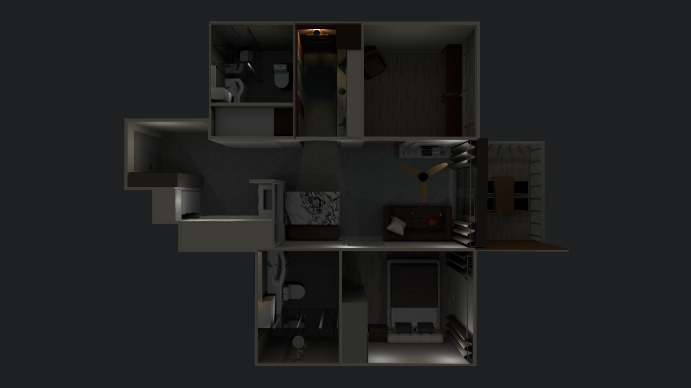

# 🏠 Home Assistant — Smart Home Configuration

A self-hosted smart home automation platform built on **Home Assistant**, running on a **Raspberry Pi** with **Zigbee2MQTT** for device management. This setup covers presence-based automations, scheduled scenes, and a custom 3D interactive floor plan dashboard for intuitive device control.

---

## 📸 Dashboard Preview

> *3D interactive floor plan with clickable device controls*

<!-- Replace the line below with your actual screenshot -->


---

## 🛠️ Tech Stack

| Component | Details |
|---|---|
| Platform | Home Assistant (self-hosted) |
| Hardware | Raspberry Pi |
| Zigbee Coordinator | Sonoff Zigbee 3.0 USB Dongle |
| Zigbee Stack | Zigbee2MQTT |
| Remote Access | Cloudflare Tunnel |
| Dashboard | Custom Lovelace UI with 3D floor plan |

---

## 📦 Devices

- **Smart Switches** — Zigbee-controlled wall switches throughout the home
- **LED Strip Controllers** — Zigbee-controlled ambient lighting
- **Smart Curtains/Blinds** — Motorised curtains integrated with morning/departure scenes
- **Smart Lights & TV** — Integrated into arrival and mood scenes

---

## ⚡ Automations

### 🏡 Arrival Scene
Triggered when a person arrives home. Automatically:
- Turns on the TV
- Plays music
- Sets lighting mood based on time of day

### 🚪 Departure Scene
Triggered when all occupants leave home. Automatically:
- Turns off all devices
- Ensures no standby power waste

### 🌅 Morning Scene
Scheduled morning routine that:
- Opens curtains
- Turns on specific lights and appliances
- Runs conditionally based on day/time

---

## 🗺️ Custom 3D Floor Plan Dashboard

Built a fully interactive 3D floor plan using a custom Lovelace card, allowing room-by-room control of all devices via clickable icons overlaid on the floor plan. Replaces the default entity-list UI with a spatial, intuitive interface.

---

## 🔐 Remote Access

Secure remote access configured via **Cloudflare Tunnel** — no open ports, no VPN required. The Home Assistant instance is accessible externally through a private domain without exposing the Raspberry Pi directly to the internet.

---

## 📁 Repository Structure

```
.
├── automations.yaml        # All automation rules
├── scenes.yaml             # Defined scenes (arrival, departure, morning)
├── scripts.yaml            # Helper scripts
├── configuration.yaml      # Main HA configuration
├── lovelace.yaml           # Custom dashboard config
├── zigbee2mqtt/
│   └── configuration.yaml  # Zigbee2MQTT config (secrets removed)
└── screenshots/
    └── floorplan.png       # Dashboard preview
```

---

## ⚠️ Security Notes

All secrets, tokens, API keys, and personal credentials are managed via `secrets.yaml` and are **not included** in this repository. IP addresses and location data have been removed from all config files.
